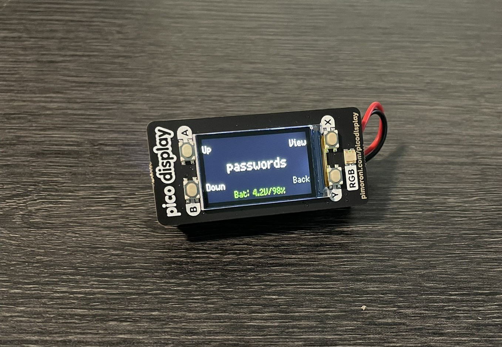
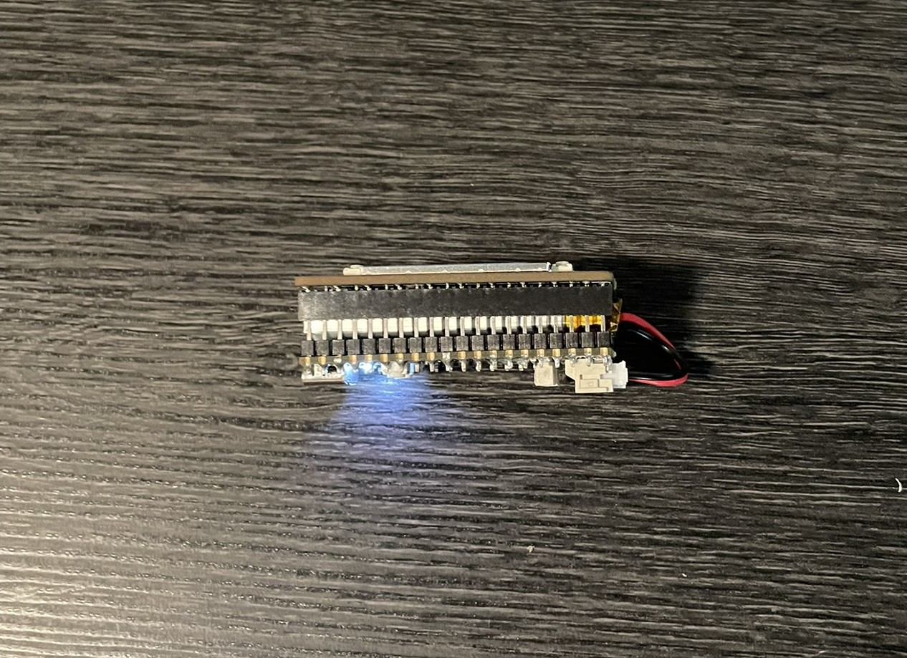
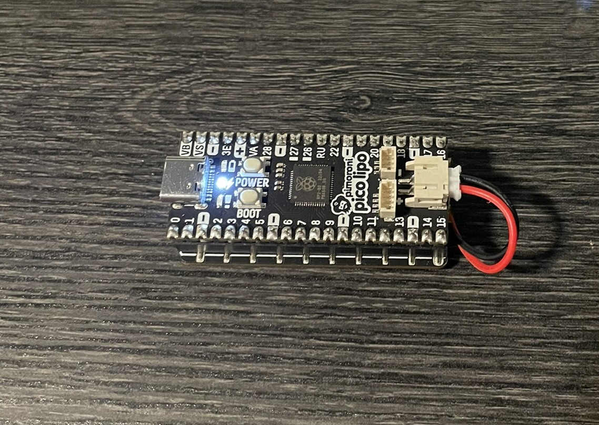

# 🔐 Password Keeper

A simple MicroPython gadget for storing passwords, PINs, short notes, and other sensitive information on a Raspberry Pi Pico with a display. Designed to be fast, offline, and secure — no connectivity, no syncing, just a local JSON file you can edit manually.

## Features

- Scroll through stored entries using buttons
- Displays one entry at a time for discretion
- Stores data in a human-readable and editable `data.json` file
- Optional LiPo battery support with charge indicator
- Instant-on: boots directly into view mode

## Photos





## Hardware

- Pimoroni Pico LiPo (or any RP2040 board with battery support)
- Pimoroni Pico Display Pack
- LiPo battery (optional)

## Getting Started

1. Flash MicroPython onto your board if you haven’t already.
2. Copy `main.py` and `info.json` to your Pico using Thonny.
3. Edit `data.json` to add your own entries.
4. Press the reset button or power cycle the board.

### Example `data.json`

```json
{
  "GitHub": "hunter2",
  "Email": "passw0rd!",
  "Router Login": "admin:admin",
  "Safe combo": "L12-R34-L56"
}
