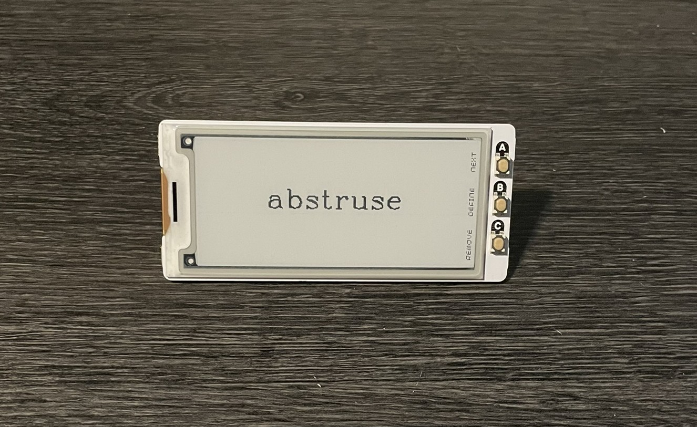
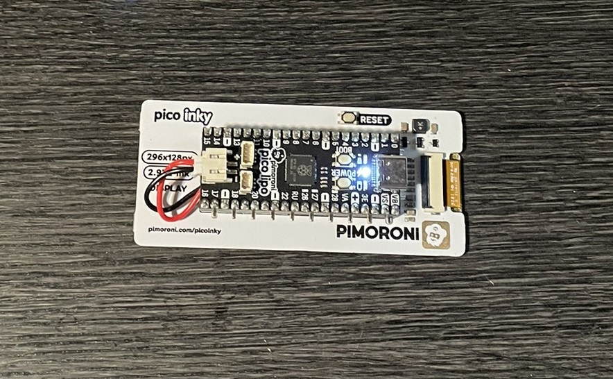

# Vocabulary Builder

A flashcard-style vocabulary gadget for learning and reviewing English words.

  
  


## Features

- Browse word-definition pairs one at a time
- Mark entries as known
- Human-editable JSON data format (`vocab.json`)
- Instant-on, zero-dependency design
- Optional LiPo battery support with charge status display

## Hardware

- [Pimoroni Pico LiPo](https://shop.pimoroni.com/products/pico-lipo-16mb)  
- [Pimoroni Pico Inky Pack](https://shop.pimoroni.com/products/pico-inky-pack)

## File Format

Vocabulary is stored in a `vocab.json` file. Each entry is a dictionary with a `word`, a `definition`.

```json
[
    {
        "word": "abstruse",
        "definition": "difficult to understand; obscure",
        "example": "The professor's lectures were so abstruse that students often left confused."
    },
    {
        "word": "bellicose",
        "definition": "demonstrating aggression and willingness to fight",
        "example": "His bellicose behavior at the meeting annoyed everyone."
    }
]
```
